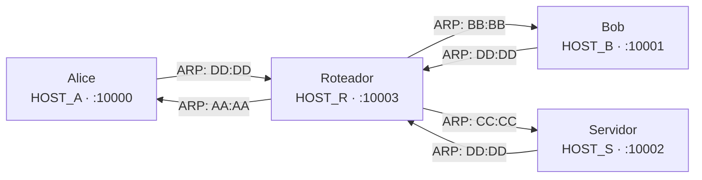

# A Mini Net

Projeto integrador da disciplina de **Redes de Computadores – INF-UFG 2025/4**.

O produto final é uma aplicação de **chat** que funciona sobre esse canal
defeituoso.

```
┌─────────────┐
│  Aplicação  │  <- Último Implementado
├─────────────┤
│  Transporte │  <- Quarto Implementado
├─────────────┤
│    Rede     │  <- Terceiro Implementado
├─────────────┤
│   Enlace    │  <- Segundo Implementado
├─────────────┤
│   Física    │  <- Primeiro Implementado
├─────────────┤
│  UDP real   │
└─────────────┘
```

## Topologia



Todos os nós rodam em `127.0.0.1`, diferenciados pela porta. Hosts enxergam o
Roteador como único vizinho via ARP. O Roteador conhece todos diretamente.

| Host     | VIP    | MAC               | Porta |
| -------- | ------ | ----------------- | ----- |
| Alice    | HOST_A | AA:AA:AA:AA:AA:AA | 10000 |
| Bob      | HOST_B | BB:BB:BB:BB:BB:BB | 10001 |
| Servidor | HOST_S | CC:CC:CC:CC:CC:CC | 10002 |
| Roteador | HOST_R | DD:DD:DD:DD:DD:DD | 10003 |

## Código fornecido pelo professor

O módulo `net.base` (`src/net/base/protocol.py`) é fornecido pronto e não deve
ser modificado. Ele define as três PDUs da pilha — `Segmento`, `Pacote` e
`Quadro` — bem como a função `enviar_pela_rede_ruidosa`, que injeta perda,
corrupção de bits e latência variável antes de chamar `sock.sendto`. Todo o
resto do projeto consome essas abstrações mas não as reimplementa.

## Ordem de Desenvolvimento

### 1 — Endereços

Classes que padronizam e validam os tipos de endereço usados em toda a pilha:
`Port`, `IPAddress`, `VirtualIPAddress`, `MACAddress`, `Address` e `VirtualAddress`.

### 2 — Camada Física · `UDPSimulated`

`UDPSimulated` abre um socket UDP, usa `enviar_pela_rede_ruidosa` (professor)
para enviar e `sock.recvfrom` para receber, resolvendo o MAC de destino numa
tabela estática para obter o endereço UDP real. `build_physical_layer(name)`
cria o socket e faz `bind` antes de retornar.

### 3 — Camada de Enlace · `SimpleLink`

`SimpleLink` encapsula pacotes em `Frame` (professor), delega o envio à camada
física e, na recepção, verifica a integridade via CRC (professor). A resolução
de endereços físicos é feita por tabela ARP estática: Alice, Bob e Servidor
apontam apenas para o Roteador. O Roteador conhece todos.
`build_link_layer(name)` compõe a camada física internamente.

### 4 — Camada de Rede · `HostNetwork` / `RouterNetwork`

- **`HostNetwork`** — hosts comuns. `send()` consulta a tabela de roteamento e
  delega ao enlace. `receive()` bloqueia até um pacote endereçado ao VIP local
  e devolve o `Segment` interno.

- **`RouterNetwork`** — roteador. `receive()` decrementa o TTL, descarta se
  expirado e reencaminha via enlace. Sempre retorna `None`.

`build_network_layer(name)` escolhe a implementação correta e compõe as camadas
inferiores.

### 5 — Camada de Transporte · `ReliableConnection` / `ReliableTransport`

- **`ReliableConnection`** — Stop-and-Wait para um par de endereços. `send()`
  fragmenta em chunks de MSS e retransmite até receber ACK. `receive()`
  reagrupa até `more=False`. `close()` envia FIN unilateral e aguarda ACK.
  `dispatch()` é chamado pelo transport para rotear segmentos às filas internas.

- **`ReliableTransport`** — multiplexador com thread daemon que lê
  continuamente da rede e despacha para a conexão correta pela chave
  `(remote_vip, remote_port, local_port)`. `connect()` abre uma conexão
  de saída; `accept()` bloqueia até uma entrada ser detectada.

`build_transport_layer(name)` monta a pilha completa e retorna o transport já
ativo. Não aceita o roteador.

### 6 — Camada de Aplicação · `Server` / `Client`

- **`Server`** — servidor centralizado que aceita conexões de clientes,
  gerencia a lista de usuários online e retransmite mensagens entre pares. Ao
  conectar, cada cliente recebe automaticamente a lista de usuários já online.
  Suporta **shutdown gracioso**: ao receber `Ctrl+C`, transmite `__SHUTDOWN__`
  para todos os clientes e aguarda cada um fechar sua conexão (FIN) antes de
  encerrar, sem descartar mensagens já enfileiradas.

- **`Client`** — conecta ao servidor assim que é iniciado. A UI sobe
  imediatamente enquanto a conexão TCP é estabelecida em background. Ao receber `__SHUTDOWN__`, fecha a conexão sozinho. Suporta duas interfaces intercambiáveis via protocolo `UI`:
  - **`ConsoleUI`** — stdin/stdout com comando `/file <caminho>` para envio de
    arquivos.
  - **`GUI`** — interface Tkinter com área de chat, lista de usuários online e
    barra de status.

  A seleção da UI é automática: sem TTY ou com `--gui`, usa a GUI.

- **`PrioritySender`** — elimina HOL blocking causado por transferências de
  arquivo. Envolve uma `Connection` e despacha de uma `PriorityQueue` em thread
  separada. Mensagens de sistema (prioridade 0) e texto (1) ultrapassam arquivos
  (2) na fila, mantendo o chat responsivo durante uploads.

**Protocolo de mensagens (JSON):**

Todas as mensagens são serializadas em JSON com os campos `type`, `sender`,
`recipient` e `timestamp`. Mensagens de texto incluem `content`. Mensagens de
arquivo adicionam `name`, `mime`, `size` e `data` (Base64). Mensagens de
sistema são notificações internas sem remetente.

## Instalação

Clone o repositório e instale o pacote em modo editável.

**Com uv (recomendado):**

```bash
uv sync
```

**Com pip:**

```bash
python3 -m venv .venv
source .venv/bin/activate   # Windows: .venv\Scripts\activate
pip install -e .
```

## Como executar

Inicie os componentes na seguinte ordem:

**1. Roteador** (necessário para comunicação entre hosts):

```bash
uv run router
# Com ambiente ativo: router
```

**2. Servidor** (centraliza as conexões):

```bash
uv run server
# Com ambiente ativo: server
```

**3. Clientes** (Alice e Bob):

```bash
# Alice - interface automática (console se TTY disponível)
uv run alice
# Com ambiente ativo: alice

# Alice - forçar interface gráfica
uv run alice -- --gui
# Com ambiente ativo: alice --gui

# Bob - interface automática
uv run bob
# Com ambiente ativo: bob

# Bob - forçar interface gráfica
uv run bob -- --gui
# Com ambiente ativo: bob --gui
```

**Comandos no console:**

- Digite texto e pressione Enter para enviar mensagem
- `/file <caminho>` para enviar arquivo
- `Ctrl+C` para sair

**Interface gráfica:**

- Digite na caixa de texto e pressione Enter ou clique "Enviar"
- Botão "Arquivo" para selecionar e enviar arquivo
- Lista de usuários online atualizada em tempo real
- Barra de status mostra conexão

Todos os arquivos recebidos são salvos em `downloads/<destinatário>/`.
