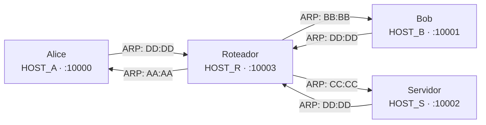

# A Mini Net

Projeto integrador da disciplina de **Redes de Computadores – INF-UFG 2025/4**.

O produto final é uma aplicação de **chat** que funciona sobre esse canal
defeituoso.

```
┌─────────────┐
│  Aplicação  │  <- A implementar
├─────────────┤
│  Transporte │  <- A implementar
├─────────────┤
│    Rede     │  <- Terceiro Implementado
├─────────────┤
│   Enlace    │  <- Segundo Implementado
├─────────────┤
│   Física    │  <- Primeiro Implementado
├─────────────┤
│  UDP real   │
└─────────────┘
```

## Topologia



Todos os nós rodam em `127.0.0.1`, diferenciados pela porta. Hosts enxergam o
Roteador como único vizinho via ARP. O Roteador conhece todos diretamente.

| Host     | VIP    | MAC               | Porta |
| -------- | ------ | ----------------- | ----- |
| Alice    | HOST_A | AA:AA:AA:AA:AA:AA | 10000 |
| Bob      | HOST_B | BB:BB:BB:BB:BB:BB | 10001 |
| Servidor | HOST_S | CC:CC:CC:CC:CC:CC | 10002 |
| Roteador | HOST_R | DD:DD:DD:DD:DD:DD | 10003 |

## Código fornecido pelo professor

O módulo `net.base` (`src/net/base/protocol.py`) é fornecido pronto e não deve
ser modificado. Ele define as três PDUs da pilha — `Segmento`, `Pacote` e
`Quadro` — bem como a função `enviar_pela_rede_ruidosa`, que injeta perda,
corrupção de bits e latência variável antes de chamar `sock.sendto`. Todo o
resto do projeto consome essas abstrações mas não as reimplementa.

## Ordem de Desenvolvimento

### 1 — Endereços

Classes que padronizam e validam os tipos de endereço usados em toda a pilha:
`Port`, `IPAddress`, `VirtualIPAddress`, `MACAddress`, `Address` e `VirtualAddress`.

### 2 — Camada Física · `UDPSimulated`

`UDPSimulated` abre um socket UDP, usa `enviar_pela_rede_ruidosa` (professor)
para enviar e `sock.recvfrom` para receber, resolvendo o MAC de destino numa
tabela estática para obter o endereço UDP real. `build_physical_layer(name)`
cria o socket e faz `bind` antes de retornar.

### 3 — Camada de Enlace · `SimpleLink`

`SimpleLink` encapsula pacotes em `Frame` (professor), delega o envio à camada
física e, na recepção, verifica a integridade via CRC (professor). A resolução
de endereços físicos é feita por tabela ARP estática: Alice, Bob e Servidor
apontam apenas para o Roteador. O Roteador conhece todos.
`build_link_layer(name)` compõe a camada física internamente.

### 4 — Camada de Rede · `HostNetwork` / `RouterNetwork`

Duas implementações sobre `Pacote` (professor), sem base compartilhada:

- **`HostNetwork`** — para Alice, Bob e Servidor. `send()` consulta a tabela
  de roteamento, cria o `Packet` com TTL inicial e delega ao enlace.
  `receive()` bloqueia até que um pacote endereçado ao VIP local chegue e
  devolve o `Segment` interno.

- **`RouterNetwork`** — para o Roteador. Uma thread daemon bloqueia em
  `link.receive()` e enfileira os pacotes recebidos. `receive()` consome da
  fila, decrementa o TTL, descarta se expirado e encaminha via enlace.
  Sempre retorna `None` — roteadores não entregam segmentos à aplicação.

`build_network_layer(name)` escolhe a implementação correta e compõe enlace e
física internamente.

## Instalação

Clone o repositório e instale o pacote em modo editável.

**Com uv (recomendado):**

```bash
uv sync
```

**Com pip:**

```bash
python3 -m venv .venv
source .venv/bin/activate   # Windows: .venv\Scripts\activate
pip install -e .
```

## Como executar

**Com uv:**

```bash
uv run router
```

**Com pip (ambiente ativo):**

```bash
router
```
